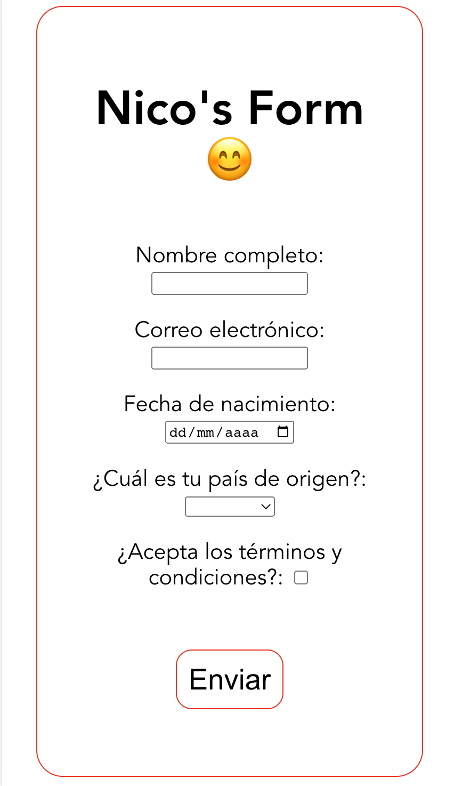
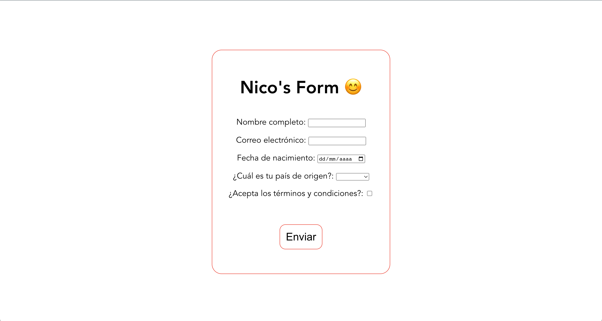

# greydive-challenge by Nico

Hola! 👋

Hice el deploy en Vercel, pueden verlo acá: https://greydive-challenge-nu.vercel.app/

Como pueden ver, busqué que el diseño de la página fuese simple, y que al leer el json los datos del formulario sean cargados dinámicamente
(osea que se pueden agregar más campos al json y el formulario va a agregarlos).

Usé [vite](https://vitejs.dev/) y no [create-react-app](https://create-react-app.dev/) porque este último tiene un cold start muy alto.

No usé CSS Frameworks e intenté no usar librerías, solo agregué [uuid](https://www.npmjs.com/package/uuid)

Las credenciales para Firebase son cargadas por medio de un archivo .env para no exponerlas en github.

